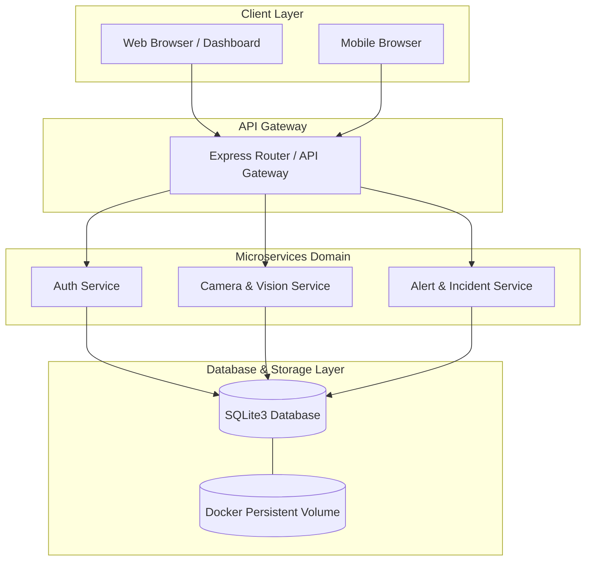
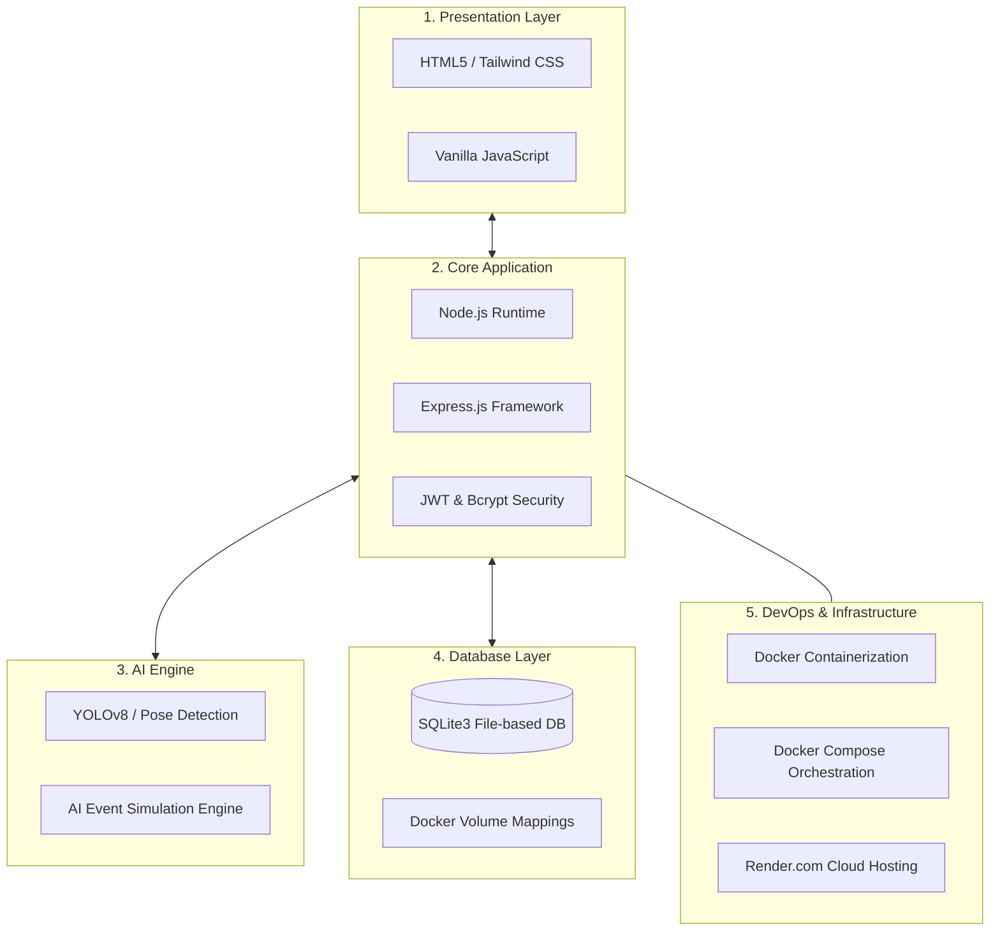

# 🛡️ AI Safety Sight - ระบบเฝ้าระวังความปลอดภัยด้วยกล้องวงจรปิดและ AI

**AI Safety Sight** คือระบบจำลองการเฝ้าระวังความปลอดภัยในพื้นที่เขตก่อสร้างหรือโรงงานอุตสาหกรรมแบบเรียลไทม์ ผ่านกล้องวงจรปิดร่วมกับระบบวิเคราะห์ด้วย AI เพื่อตรวจจับความเสี่ยงและแจ้งเตือนอุบัติเหตุล่วงหน้า

---

## 📐 Microservices Architecture



---

## 🛠️ Technology Stack Diagram



---

## 📁 โครงสร้างไฟล์และหน้าที่ของแต่ละส่วน (Project Structure)

```text
AI-Safety-Sight/
├── server.js            # ไฟล์หลักระบบ Backend (REST API + Node.js + SQLite Database)
├── package.json         # รายการ Dependencies และคำสั่งรันโปรเจกต์
├── Dockerfile           # การตั้งค่าสภาพแวดล้อม Docker สำหรับตัวแอปพลิเคชัน
├── docker-compose.yml   # ไฟล์สำหรับสั่งเปิดใช้งานระบบผ่าน Docker Container
├── public/
│   └── index.html       # หน้าจอหลัก Single Page Application (UI ภาษาไทย + Tailwind CSS)
└── README.md            # คู่มือการใช้งานและคำอธิบายระบบ
```

---

## 🔑 บัญชีผู้ใช้สำหรับทดสอบระบบ (Demo Accounts)

| Username | Password | Role | สิทธิ์การใช้งาน |
| :--- | :--- | :--- | :--- |
| `admin` | `Admin123!` | Administrator | จัดการผู้ใช้, ดูภาพกล้อง, ดูการแจ้งเตือน |
| `supervisor` | `Super123!` | Supervisor | ดูภาพกล้อง และจัดการระบบความปลอดภัย |
| `operator` | `Oper123!` | Operator | ดูภาพกล้องและรับการแจ้งเตือน |

---

## 🚀 วิธีเปิดใช้งานระบบ (How to Run)

### วิธีที่ 1: รันด้วย Docker (แนะนำ)
1. เปิด Docker Desktop ในเครื่อง
2. เปิด Terminal ในโฟลเดอร์โปรเจกต์ แล้วรันคำสั่ง:
   ```bash
   docker compose up --build
   ```
3. เปิดเบราว์เซอร์แล้วไปที่: `http://localhost:3000`

### วิธีที่ 2: รันด้วย Node.js โดยตรง
1. ติดตั้ง Dependencies:
   ```bash
   npm install
   ```
2. เริ่มต้นรันเซิร์ฟเวอร์:
   ```bash
   npm start
   ```
3. เปิดเบราว์เซอร์แล้วไปที่: `http://localhost:3000`

---

## 🌐 REST API Endpoints

* **POST** `/api/login` - เข้าสู่ระบบรับ JWT Token
* **POST** `/api/register` - สมัครสมาชิกใหม่
* **GET** `/api/me` - ดึงข้อมูลผู้ใช้งานปัจจุบัน
* **GET** `/api/cameras` - ดึงข้อมูลรายการกล้องวงจรปิดและสถานะ AI
* **GET** `/api/alerts` - ดึงรายการประวัติการแจ้งเตือนความไม่ปลอดภัย
* **GET** `/api/users` - ดึงรายชื่อผู้ใช้งานระบบ (เฉพาะ Admin)